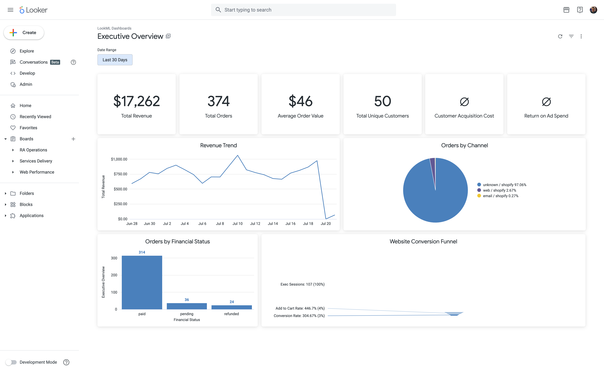
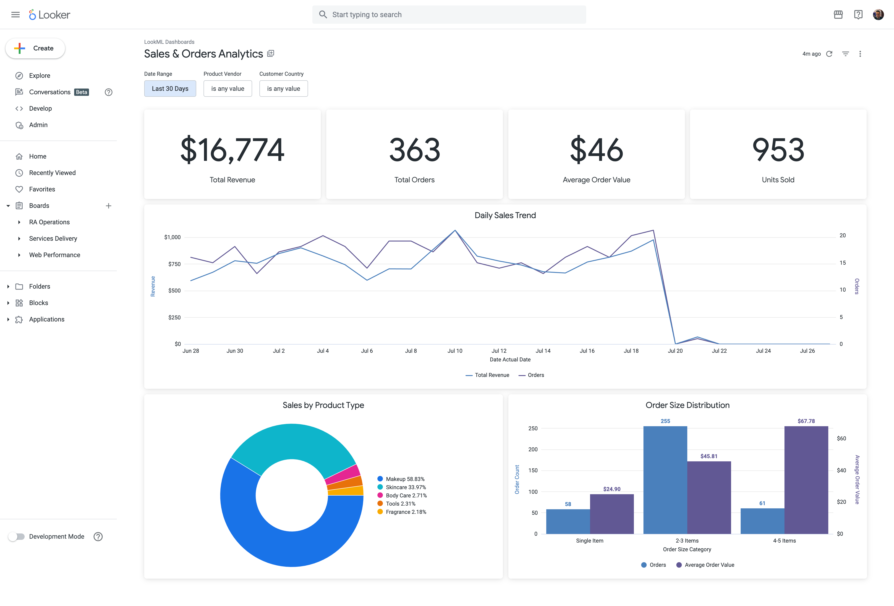
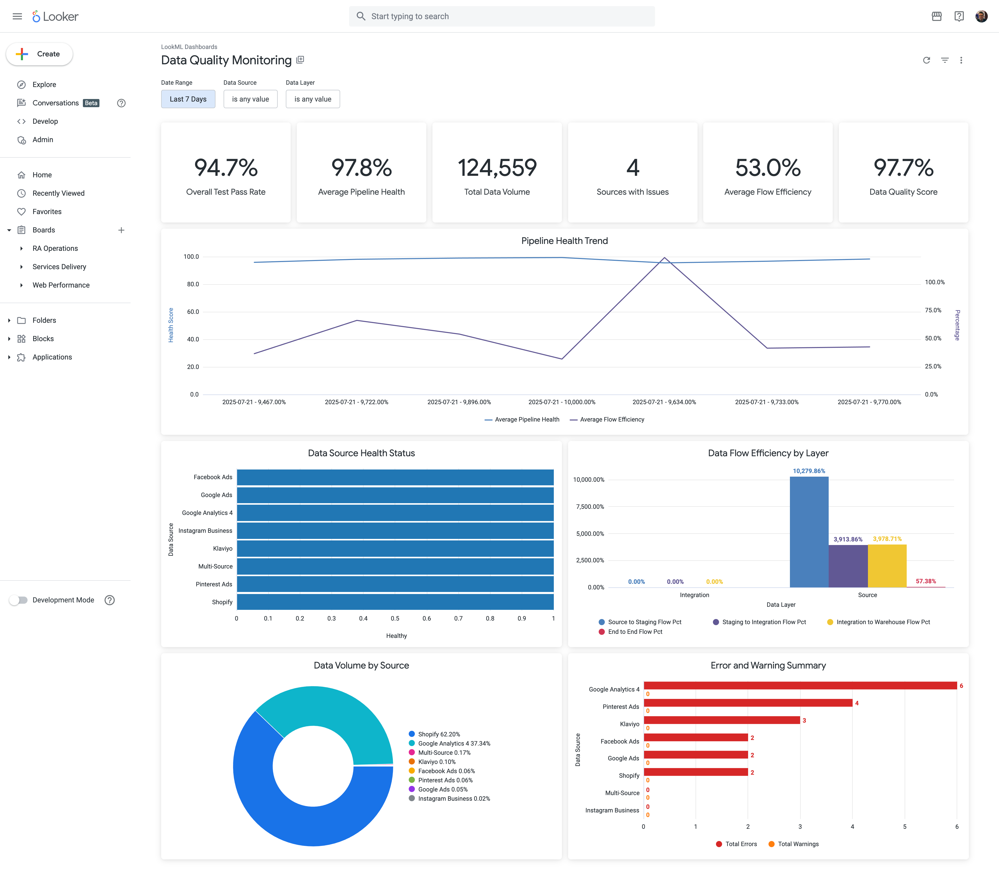

# LookML Project Documentation

This document provides comprehensive documentation for the Ra Ecommerce Analytics LookML project, including setup instructions, architecture overview, and usage guidelines.

## Table of Contents
- [Overview](#overview)
- [Project Structure](#project-structure)
- [Recent Updates](#recent-updates)
- [Setup Instructions](#setup-instructions)
- [View Files Documentation](#view-files-documentation)
- [Model and Explores](#model-and-explores)
- [Dashboards](#dashboards)
- [Best Practices](#best-practices)
- [Deployment Guide](#deployment-guide)

## Overview

The Ra Ecommerce Analytics LookML project provides a comprehensive business intelligence layer on top of the dbt-transformed data warehouse. It includes:

- **16 View Files**: Representing fact and dimension tables with calculated dimensions and measures
- **12 Explores**: Pre-configured analysis paths for different use cases including attribution analysis
- **3 LookML Dashboards**: Executive Overview, Sales & Orders Analytics, and Data Quality Monitoring
- **Advanced Features**: Multi-touch attribution, SCD Type 2 support, data quality monitoring, and comprehensive KPI tracking

## Project Structure

```
lookml/
├── models/
│   └── ecommerce_demo.model.lkml          # Main model with all explores
├── views/
│   ├── dim_channels.view.lkml             # Channel dimension
│   ├── dim_customer_metrics.view.lkml     # Customer metrics dimension
│   ├── dim_customers.view.lkml            # Customer dimension
│   ├── dim_date.view.lkml                # Date dimension
│   ├── dim_products.view.lkml            # Product dimension
│   ├── dim_social_content.view.lkml      # Social content dimension
│   ├── fact_customer_journey.view.lkml   # Customer journey fact
│   ├── fact_data_quality.view.lkml       # Data quality metrics
│   ├── fact_email_marketing.view.lkml    # Email marketing fact
│   ├── fact_events.view.lkml             # GA4 events fact
│   ├── fact_inventory.view.lkml          # Inventory fact
│   ├── fact_marketing_performance.view.lkml # Marketing performance
│   ├── fact_order_items.view.lkml        # Order items fact
│   ├── fact_orders.view.lkml             # Orders fact
│   ├── fact_sessions.view.lkml           # Web sessions fact
│   └── fact_social_posts.view.lkml       # Social posts fact
└── dashboards/
    ├── executive_overview.dashboard.lookml
    ├── sales_orders_analytics.dashboard.lookml
    └── data_quality_monitoring.dashboard.lookml
```

## Recent Updates

### Key Changes (January 2025)

1. **Fixed Data Type Issues**: 
   - Updated `dim_date.date_actual` from `datetime` to `timestamp` datatype for consistency
   - Fixed DATE vs TIMESTAMP comparison errors in explores

2. **Dashboard Improvements**:
   - Fixed percentage formatting in Data Quality Monitoring dashboard (values now display correctly as 97.8% instead of 9778%)
   - Added % suffix to all percentage metrics
   - Updated conditional formatting thresholds for Average Pipeline Health metric

3. **Model Enhancements**:
   - Added `attribution_analysis` explore as an alias for `fact_customer_journey`
   - Fixed marketing performance explore joins to use proper date conversions
   - Included dashboard files in the model configuration

4. **Dashboard Consolidation**:
   - Streamlined to 3 core dashboards from 4
   - Removed separate marketing attribution dashboard (functionality integrated into other dashboards)

## Setup Instructions

### Prerequisites

1. **Looker Instance**: Access to a Looker instance (cloud or on-premise)
2. **BigQuery Connection**: Configured connection named `ra_dw_prod`
3. **Permissions**: 
   - Looker: Developer permissions
   - BigQuery: Data Viewer access to the warehouse dataset
4. **Data Warehouse**: Deployed Ra Ecommerce Data Warehouse v2 in BigQuery

### Installation Steps

#### 1. Create New LookML Project

In Looker:
1. Navigate to **Develop** → **Manage LookML Projects**
2. Click **New LookML Project**
3. Name: `ecommerce_demo`
4. Starting Point: "Blank Project"

#### 2. Configure Git Connection

```bash
# In your local development environment
cd /path/to/lookml/project
git init
git remote add origin <your-git-repo-url>
```

#### 3. Create Project Structure

```bash
# Create directories
mkdir -p views models dashboards

# Copy all LookML files to appropriate directories
```

#### 4. Configure Database Connection

In Looker Admin:
1. Go to **Admin** → **Database** → **Connections**
2. Create or verify connection:
   - Name: `ra_dw_prod`
   - Dialect: Google BigQuery Standard SQL
   - Project: Your GCP Project ID (e.g., `ra-development`)
   - Dataset: `analytics_ecommerce_ecommerce`

#### 5. Deploy and Validate

```bash
# Commit and deploy
git add .
git commit -m "Initial LookML project setup"
git push origin main

# In Looker
# Click "Deploy to Production"
# Run LookML Validator
```

## View Files Documentation

### Date Dimension (`dim_date.view.lkml`)

Central time dimension for all date-based analysis:

**Key Dimensions:**
- `date_key`: Primary key (YYYYMMDD format)
- `date_actual`: Full date with timeframes (now using timestamp datatype)
- `fiscal_*`: Fiscal calendar dimensions
- `is_weekend`, `is_holiday`: Boolean flags
- `season`: Derived season based on month

**Key Measures:**
- `count`: Number of dates
- `count_days`: Total days in period

### Customer Dimension (`dim_customers.view.lkml`)

Customer dimension with demographic and value attributes:

**Key Dimensions:**
- `customer_key`: Surrogate key
- `customer_id`: Natural key from source
- `customer_name`: Full name
- `email`: Customer email
- `customer_type`: New/returning classification

**Key Measures:**
- `count`: Total customers
- `count_current`: Active customers

### Product Dimension (`dim_products.view.lkml`)

Product catalog with categories and pricing:

**Key Dimensions:**
- `product_key`: Surrogate key
- `product_id`: SKU/product code
- `product_name`: Product title
- `product_type`: Category classification
- `product_status`: Active/discontinued

**Key Measures:**
- `count`: Total products
- `average_price`: Mean product price

### Orders Fact (`fact_orders.view.lkml`)

Granular order line item data:

**Key Dimensions:**
- `order_line_sk`: Primary key
- `order_size_category`: Order value segmentation
- `margin_category`: Profitability classification
- `is_high_value_order`: Premium order flag

**Key Measures:**
- `total_revenue`: Sales revenue
- `average_order_value`: AOV
- `units_per_order`: Basket size
- `return_rate`: Return/refund rate

### GA4 Sessions Fact (`wh_fact_ga4_sessions.view.lkml`)

Website behavior and conversion tracking:

**Key Dimensions:**
- `channel_grouping`: Derived traffic channels
- `user_type`: New vs returning
- `is_high_engagement`: Quality session indicator
- `device_category`: Device segmentation

**Key Measures:**
- `engagement_rate`: Session quality
- `bounce_rate`: Single-page sessions
- `conversion_rate`: Goal completions
- `sessions_per_user`: User frequency

### Marketing Performance Fact (`wh_fact_marketing_performance.view.lkml`)

Campaign and ad performance metrics:

**Key Dimensions:**
- `platform`: Ad platform
- `performance_category`: ROAS-based classification
- `spend_tier`: Budget segmentation
- `campaign_duration_days`: Campaign length

**Key Measures:**
- `overall_roas`: Return on ad spend
- `overall_cpa`: Cost per acquisition
- `overall_ctr`: Click-through rate
- `total_engagement`: Social interactions

### Channel Dimension (`wh_dim_channels_enhanced.view.lkml`)

Marketing channel taxonomy and attributes:

**Key Dimensions:**
- `channel_type`: Paid/organic classification
- `performance_tier`: Quality scoring
- `cac_efficiency`: Acquisition cost efficiency
- `supports_*`: Capability flags

**Key Measures:**
- `average_conversion_rate`: Channel effectiveness
- `average_cac`: Acquisition costs
- `premium_channels`: High-value channel count

### Data Quality Fact (`wh_fact_data_quality.view.lkml`)

Pipeline monitoring and data quality:

**Key Dimensions:**
- `quality_tier`: Test pass rate classification
- `health_status`: Pipeline health
- `freshness_status`: Data recency
- `requires_attention`: Alert flag

**Key Measures:**
- `data_quality_score`: Composite health metric
- `overall_test_pass_rate`: Quality percentage
- `sources_with_issues`: Problem source count
- `error_rate`: Error frequency

## Model and Explores

### Main Explores

#### 1. Orders (Central Hub)
```lookml
explore: orders {
  join: order_date {...}
  join: customers {...}
  join: products {...}
}
```
**Use Cases**: Sales analysis, product performance, customer purchase behavior

#### 2. Customer Analytics
```lookml
explore: customer_analytics {
  sql_always_where: ${is_current} = true ;;
  join: customer_orders {...}
}
```
**Use Cases**: CLV analysis, segmentation, retention

#### 3. Marketing Performance
```lookml
explore: marketing_performance {
  join: performance_date {...}
  join: channels {...}
}
```
**Use Cases**: ROAS analysis, campaign optimization, channel comparison

#### 4. Website Analytics
```lookml
explore: website_analytics {
  join: session_date {...}
}
```
**Use Cases**: Traffic analysis, conversion optimization, user behavior

#### 5. Executive Overview
Combines multiple fact tables for C-level reporting with cross-functional metrics.

#### 6. Attribution Analysis
Advanced explore for multi-touch attribution with customer journey mapping.

### Join Patterns

All explores follow consistent patterns:
- **Time joins**: Always through date dimension
- **Dimension joins**: Via surrogate keys
- **Cardinality**: Properly defined relationships
- **Field selection**: Curated field lists to avoid confusion

## Dashboards

The LookML project includes three comprehensive dashboards designed for different audiences and use cases.

### 1. Executive Overview Dashboard



**Purpose**: High-level business performance metrics and trends for C-level executives and senior management.

**Key Visualizations**:
- **Top KPI Row**: 
  - Total Revenue (formatted as currency)
  - Total Orders (count)
  - Average Order Value
  - Total Unique Customers
  - Customer Acquisition Cost
  - Return on Ad Spend (ROAS)
  
- **Revenue Trend**: Line chart showing daily revenue over the selected period
- **Orders by Channel**: Pie chart breaking down order distribution by marketing channel
- **Orders by Financial Status**: Column chart showing paid, pending, and refunded orders
- **Marketing Spend vs Revenue**: Dual-axis chart comparing marketing investment to revenue generated
- **Website Conversion Funnel**: Funnel visualization showing sessions → add to cart → conversion rates

**Filters**: 
- Date Range (default: 30 days)
- Uses the `executive_overview` explore which combines data from orders, customers, marketing, and sessions

**Refresh**: Every 1 hour

### 2. Sales & Orders Analytics Dashboard



**Purpose**: Detailed sales performance analysis for sales teams, product managers, and operations.

**Key Visualizations**:
- **Sales KPI Tiles**:
  - Total Revenue with YoY comparison
  - Total Orders with trend
  - Average Order Value
  - Total Unique Customers
  
- **Sales Trend Analysis**: 
  - Daily revenue and order count (dual-axis)
  - 7-day moving average overlay
  
- **Product Performance**:
  - Top 10 products by revenue (horizontal bar chart)
  - Product category breakdown
  
- **Customer Analytics**:
  - Orders by customer tier
  - Customer concentration analysis
  - New vs returning customer split
  
- **Geographic Distribution**:
  - Revenue by country/region
  - Shipping vs billing location analysis

**Filters**:
- Date Range (default: 7 days)
- Product Category
- Customer Country
- Order Status

**Refresh**: Every 15 minutes

### 3. Data Quality Monitoring Dashboard



**Purpose**: Monitor data pipeline health, quality metrics, and identify data issues for data engineering and analytics teams.

**Key Visualizations**:
- **Quality Metrics Row**:
  - Overall Test Pass Rate (97.8% - with color coding)
  - Average Pipeline Health (97.8% - green/yellow/red thresholds)
  - Total Data Volume (row count across all layers)
  - Sources with Issues (count with conditional formatting)
  - Average Flow Efficiency (53.0% - data movement efficiency)
  - Data Quality Score (97.7% - composite metric)
  
- **Pipeline Health Trend**: Multi-line chart showing health metrics over time
  
- **Data Source Health Status**: Stacked bar chart showing health status by data source
  
- **Data Flow Efficiency by Layer**: Column chart showing efficiency percentages:
  - Source to Staging flow
  - Staging to Integration flow  
  - Integration to Warehouse flow
  - End-to-end flow percentage
  
- **Data Volume by Source**: Pie chart showing relative data volumes
  
- **Error and Warning Summary**: Bar chart highlighting sources with quality issues

**Filters**:
- Date Range (default: 7 days)
- Data Source (multi-select)
- Data Layer (staging, integration, warehouse)

**Refresh**: Every 15 minutes

**Note**: All percentage values have been corrected to display properly (e.g., 97.8% instead of 9778%) with appropriate conditional formatting for visual alerts.

## Best Practices

### Development Workflow

1. **Use Version Control**: Always develop in a Git branch
2. **Test Thoroughly**: Validate explores before deploying
3. **Document Changes**: Update view descriptions
4. **Follow Naming Conventions**: 
   - Views: `{layer}_{type}_{name}`
   - Dimensions: `snake_case`
   - Measures: `descriptive_names`

### Performance Optimization

1. **Use Persistent Derived Tables** for complex calculations
2. **Implement Datagroups** for caching:
```lookml
datagroup: nightly_refresh {
  sql_trigger: SELECT CURRENT_DATE() ;;
  max_cache_age: "24 hours"
}
```

3. **Aggregate Awareness**: Create aggregate tables for common queries
4. **Index Hints**: Add BigQuery clustering hints in SQL

### Security Best Practices

1. **Row-Level Security**: Implement access filters
```lookml
access_filter: {
  field: customers.country
  user_attribute: country
}
```

2. **Field-Level Security**: Use `hidden: yes` for sensitive fields
3. **Model Permissions**: Set appropriate model access

### Maintenance Guidelines

1. **Regular Validation**: Run LookML validator weekly
2. **Usage Analytics**: Monitor explore usage
3. **Performance Monitoring**: Track query execution times
4. **Documentation Updates**: Keep README current

## Deployment Guide

### Production Deployment Checklist

- [ ] **Validate LookML**: No errors in validator
- [ ] **Test All Explores**: Verify data accuracy
- [ ] **Check Permissions**: Appropriate access controls
- [ ] **Update Documentation**: Current with changes
- [ ] **Performance Test**: Large date ranges
- [ ] **Create Change Log**: Document modifications

### Deployment Steps

1. **Development Environment**:
```bash
git checkout -b feature/new-analysis
# Make changes
lookml validate
git add .
git commit -m "Add new analysis"
git push origin feature/new-analysis
```

2. **Pull Request Review**:
   - Code review by team lead
   - Test in Looker dev mode
   - Validate against production data

3. **Production Deployment**:
   - Merge to main branch
   - Deploy to production in Looker
   - Verify explores and dashboards
   - Monitor for errors

### Rollback Procedure

If issues arise:
1. Revert to previous commit in Git
2. Deploy previous version in Looker
3. Investigate issues in development
4. Re-deploy after fixes

## Advanced Features

### Custom Visualizations

Add custom visualizations:
```javascript
// In custom_visualizations/
looker.plugins.visualizations.add({
  id: "custom_funnel",
  label: "Custom Funnel",
  options: {...}
})
```

### API Integration

Access via Looker API:
```python
# Python example
import looker_sdk

sdk = looker_sdk.init40()
look = sdk.run_look(look_id=123, result_format="json")
```

### Scheduling and Alerts

Set up automated delivery:
1. Create Look or Dashboard
2. Set schedule (daily, weekly, monthly)
3. Configure alerts for thresholds
4. Set delivery format (PDF, CSV, Excel)

## Troubleshooting

### Common Issues

1. **"Unknown field" errors**: Check view includes in model
2. **Join errors**: Verify relationship cardinality
3. **Permission denied**: Check connection credentials
4. **Slow queries**: Review BigQuery execution plan

### Debug Mode

Enable SQL debugging:
```lookml
# In model file
sql_trigger_value: SELECT 1 ;; # Forces cache refresh
```

View generated SQL in Explore SQL tab.

## Support and Resources

- **LookML Reference**: https://docs.looker.com/reference/lookml-quick-reference
- **BigQuery Optimization**: Review clustering and partitioning
- **Community Forum**: Looker Community for best practices
- **Internal Support**: Contact your Looker administrator

---

Copyright © 2025 Rittman Analytics. All rights reserved.